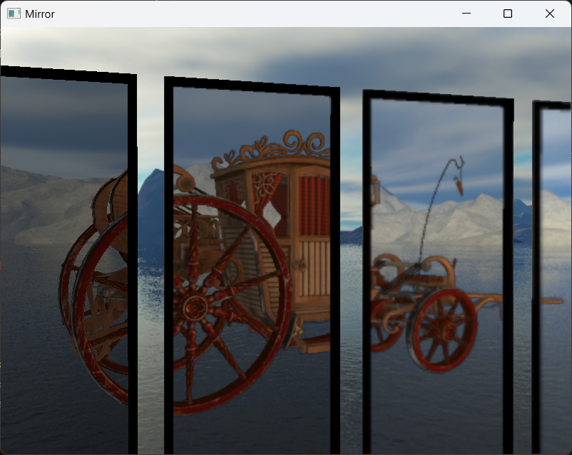
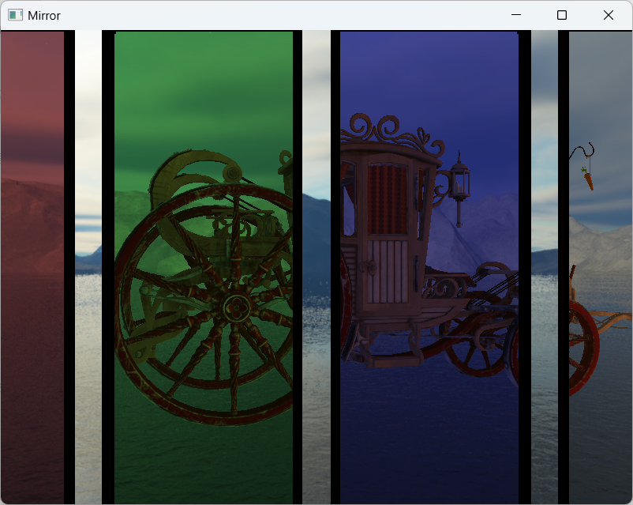
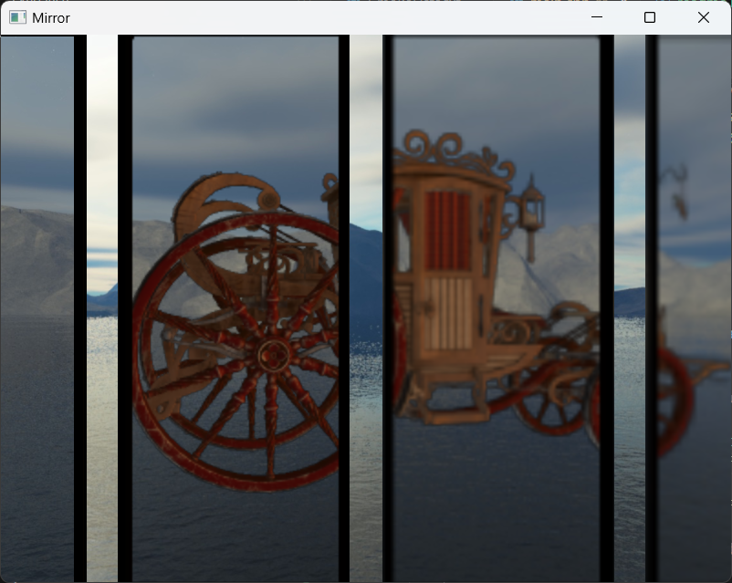
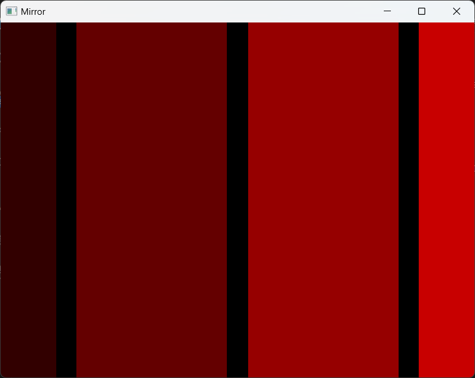
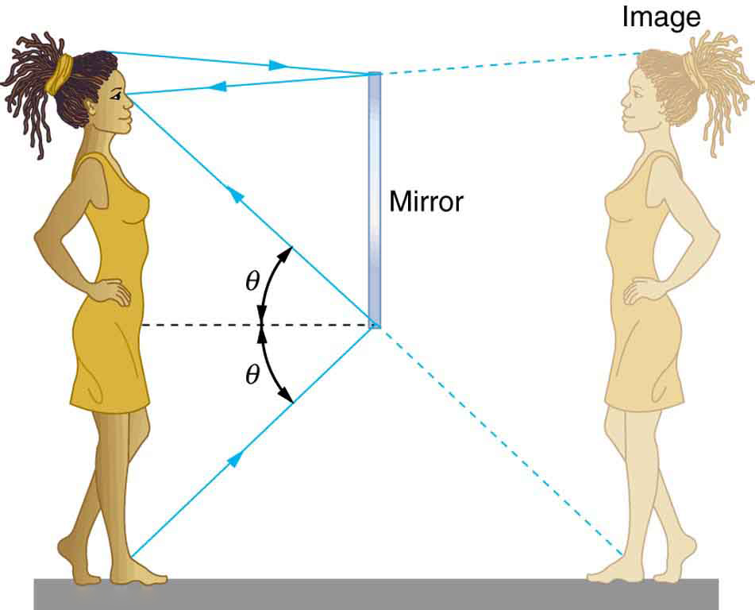
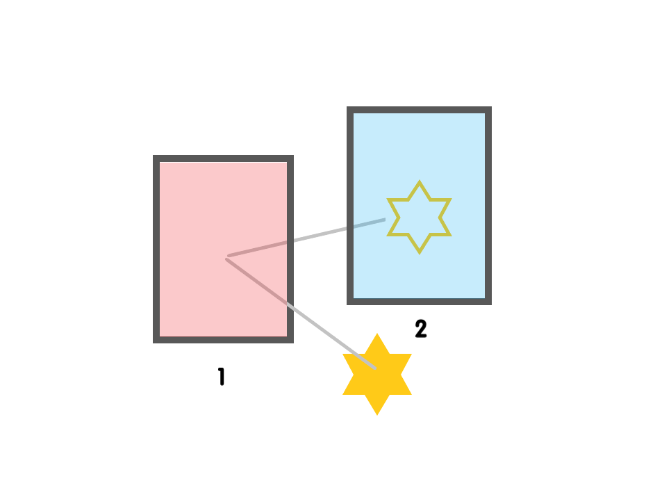
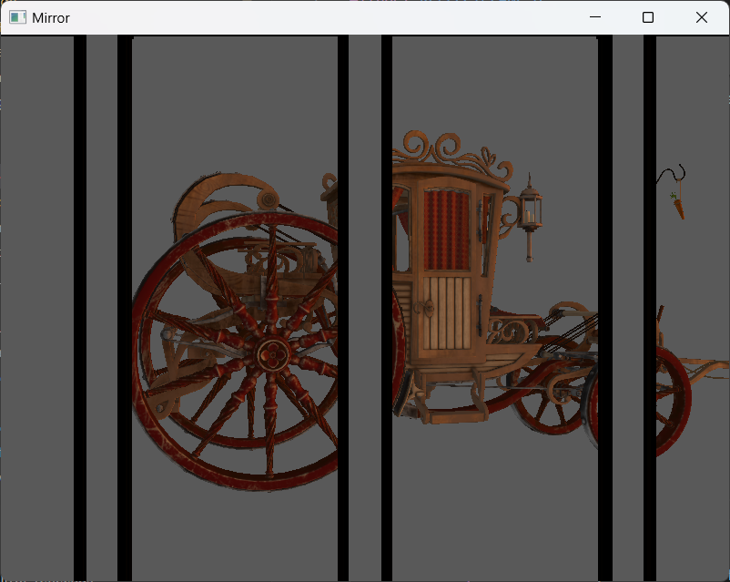
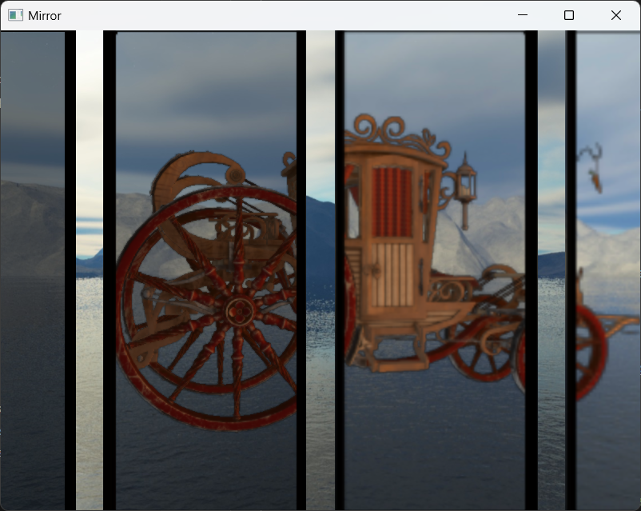

# Multiple Mirrors

## how to build
Please check [this repo](https://github.com/theamusing/OpenGL_Template). It's exactly the same.

## features
This repository provides an efficient way to render multiple mirrors in the scene.

The mirror class is defined in file [reflectPlane.hpp](./include/opengl/reflectPlane.hpp)

You can change the color for each mirror.


You can also change the roughness of each mirror to blur the reflection.


### Here is how to use it:
+ Load the model for the mirrors and set their normal direction. Each mirror is considered a reflective plane, so the model should be a flat mesh (without the frame or board).
```
ReflectPlane mirror(
    "../resources/models/mirror/classical-mirror/source/mirror.fbx",
    glm::vec3(0.0f, 0.0f, 1.0f), 
    false
);
``` 
+ Set properties like color, reflect rate and blur level for the mirror.
```
    mirror.model.position = glm::vec3(0.0f, 0.0f, 0.0f);
    mirror.model.scale = glm::vec3(0.02f, 0.02f, 0.02f);
    mirror.color = glm::vec3(1.0f);
    mirror.reflectRate = 1.0f;
    mirror.blurLevel = 0.3f;
```
+ Add all the mirrors you want to render into a reflect plane manager. 
```
    ReflectPlaneManager ourReflectPlaneManager;
    ourReflectPlaneManager.addReflectPlane(mirror);
```
+ To render the mirrors, you need to determine what can be reflected. Use a vector to store the models you want to reflect and pass them into the reflect plane manager to generate the reflection image. Then you can use your own shader to render the mirror.
```
    ourReflectPlaneManager.generateReflection(camera, ourLightManager, modelList);
    reflectShader.use();
    ourSkyBox.Attach(reflectShader, 0); // we want to reflect skybox in mirror
    reflectShader.setCamera(camera);
    ourReflectPlaneManager.Draw(reflectShader, 1);

    // The index in Draw function is used to arrange texture units, since rendering mirrors requires multiple textures. 
    // To be honest it is messy and hard to manage, but I'm just too lazy to deal with that >_<
```

## tutorial
This section contains a tutorial about how to generate the reflection for multiple mirrors.
It is a really easy one. Here we go~

### Were are my mirrors?
The first thing we need to generate a mask for mirrors in the screen, so we will know exactly what we need to draw. We are using framebuffer to imply it. If you are not familiar with framebuffer, check this [tutorial](https://learnopengl.com/Advanced-OpenGL/Framebuffers).

Each mirror has an id. The shader for rendering mask is simple: we only need to record the index on a texture. Here is the code:
```
    // in fragment shader
    FragColor = (float(maskId) + 1.0) / 255.0;
    // number 0 is considered empty, so the index starts with 1.
```
The visualized mirror mask looks like below(I modified the index so it will look brighter):



### Render reflection

Then we need to render the model reflection onto another texture(called reflection).



According to the law of reflection, we can easily determine the relationship between the image in the mirror and the actual position of the model.
```
    p_image = p_model - 2 * normal * dot(p_model - p_mirror, normal)
```
And with the mask generated above, we can make sure if the reflected image should be rendered. It is really important to use the mask. For example, if the screen space coordinates of the model's reflection in Mirror 1 fall within the screen space coordinate region of Mirror 2, then without using a mask, Mirror 2 will incorrectly sample results that do not belong to it during rendering.



Here is the pseudo code:
```
    // dealing with mirror id = k
    p_image = get_reflection_position_with_mirror_k
    uv = get_screen_uv_from_position(p_image)
    mask_id = sample_from_mask(uv)
    if mask_id != k
        discard
    else
        render_fragment_to_reflection_texture
```

If there are multiple mirrors in a scene, we'll need to calculate multiple reflections. To reduce draw call, we use geometry shader to complete this task. Geometry shader can generate multiple primitives from the original primitive. In our case, we want to generate one primitive(3 points in this case) for each mirror reflection. A shader storage buffer with mirror informations is passed to geometry shader. We can use it to generate new points.
```
    // in geometry shader
    for each mirror i:
        reflect_points = get_reflection_position_of_mirror(original_points, i)
        emit primitive
```

You can check the detail in [mirror_reflect.gs](./resources/shaders/mirror_reflect.gs).

So finally we get a screen sized texture with reflection info.



### Render mirrors
Finally, with the reflection texture, we can render our mirror.



To render image in the mirror, we need to sample from the reflection texture we just generated. Also, we need to consider global illumination(in this case, we use skybox).
Then we can blend this two colors using the alpha value of reflection texture.
(alpha == 0 : nothing)
(alpha == 1 : reflection)
Finally we blend this color with the mirror's onw color using reflect rate to get the result.
```
    // in fragment shader
    base_color = calculate_lighting(uv) // lighting on mirror itself
    reflection_color = sample_from_reflection_texture(uv, blur_level)
    environment_color = sample_from_skybox(uv, blur_level)
    reflection_color = mix(reflection_color, environment_color, reflection_color.a)
    result = mix(reflection_color, environment_color, reflect_Rate)
```

This repository provides [mirror.vs](./resources/shaders/mirror.vs) and [mirror.fs](./resources/shaders/mirror.fs) for rendering mirrors. You can also use your own shader as long as the reflection texture is passed to it. 

## tips
+ You should not render mirror to mask if the direction of mirror is not towards your camera. 
```
    dot(mirror_normal, -camera_forward) < 0
```

## future works
+ This repository didn't imply normal map, so the reflect effect is not so real. It is easy to use normal map and modify how we sample reflection textures. The point here is we do not need to make any changes on reflection texture. Just modify the way we use it.

+ Mirrors in this repository only support 1 reflection. To support a multi reflection mirror, we need to record the reflect order in mask, which requires a map from a reflection queue to a float. And also we need to record the depth of each reflection area to make sure the reflections are rendered in correct order.
